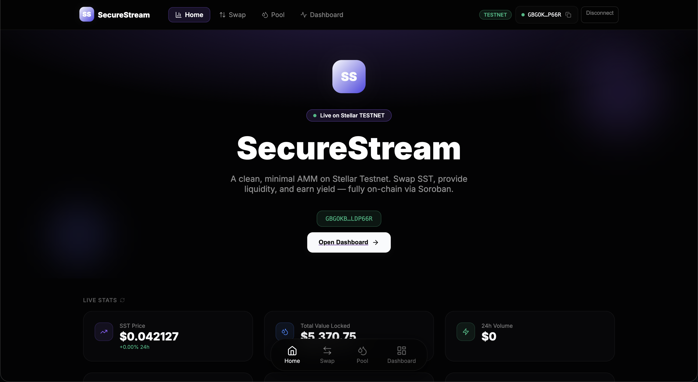
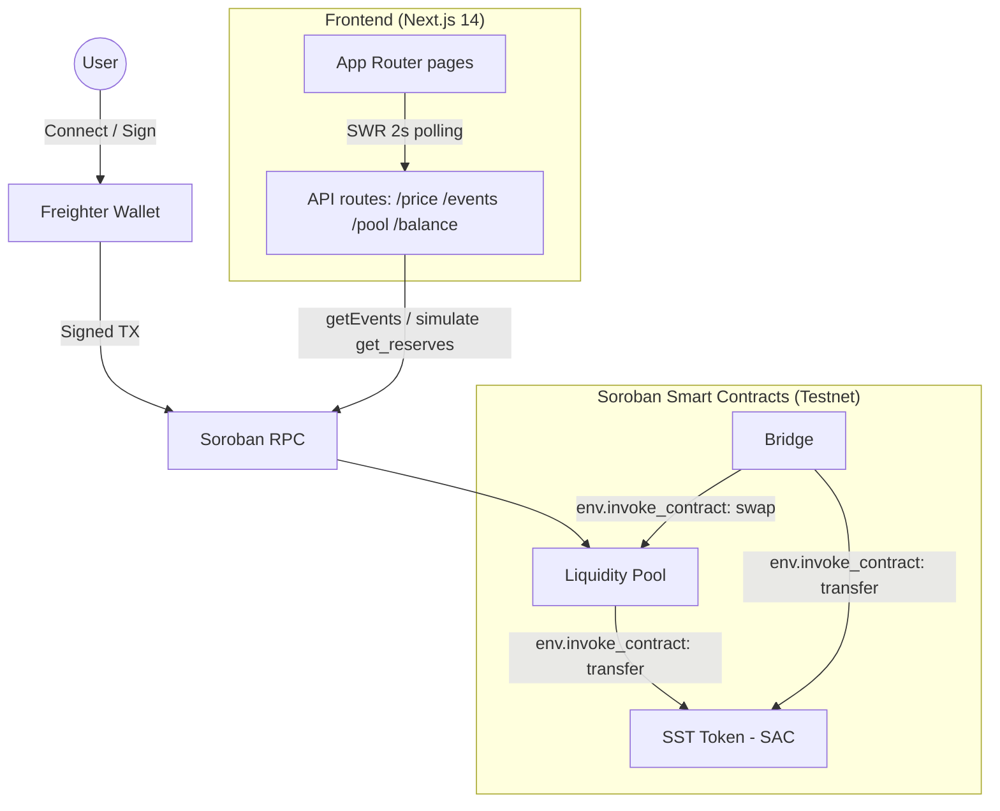

<div align="center">



# 🌌 SecureStream

**A constant-product AMM on Stellar Soroban — swap, provide liquidity, and watch live on-chain events.**

[](https://github.com/peach1241/SecureStream/actions/workflows/ci.yml)
[](https://stellar.org)
[](https://soroban.stellar.org)
[](https://nextjs.org)
[](LICENSE)

**Live Demo:** `PENDING` — the previous `secure-stream.vercel.app` link no longer serves this app; needs a fresh deploy (see [Setup](#-setup-instructions)).
**Demo Video:** [Watch Walkthrough Demo](./screenshots/demo.gif)

</div>

---

## 📝 Project Description

SecureStream is a decentralized automated market maker (AMM) built on **Stellar** using **Soroban smart contracts**. Users connect a Freighter wallet, add an SST trustline, provide SST + XLM liquidity, swap between the two assets, and watch swap/liquidity events stream into the UI in near real-time. Three contracts cooperate on-chain — the **SST** token (Stellar Asset Contract), a liquidity pool, and a bridge that batches a pool swap with a fee transfer — demonstrating genuine **inter-contract communication**.

> This is a fresh, independent deployment: brand-new issuer/distributor keypairs, a new **SST** asset, and freshly deployed pool + bridge contracts — no shared or inherited addresses. Every address and tx hash below is real and verifiable on Stellar Expert. See [`deployments/testnet.json`](deployments/testnet.json).

---

## 🏛️ Architecture



---

## 🧰 Tech Stack

- **Contracts:** Rust, Soroban SDK v21
- **Frontend:** Next.js 14 (App Router), TypeScript, plain CSS
- **Data/polling:** SWR (2–5s refresh)
- **Wallet:** Freighter (`@stellar/freighter-api`)
- **SDK:** `@stellar/stellar-sdk`
- **Tests:** `cargo test` (contracts), Vitest (frontend)
- **CI/CD:** GitHub Actions
- **Network:** Stellar Testnet (Friendbot-funded)

---

## 📜 Smart Contracts (Testnet)

| Contract | Address | Stellar Expert |
| :--- | :--- | :--- |
| **SST Token** (Stellar Asset Contract) | `CCELLZIVJGLIGBPSPW225663T5FPMMZOMYQV62M5XC6R7PAMQF2NP2T2` | [view](https://stellar.expert/explorer/testnet/contract/CCELLZIVJGLIGBPSPW225663T5FPMMZOMYQV62M5XC6R7PAMQF2NP2T2) |
| **Liquidity Pool** | `CAWL62KWM4PYN25BMG7UGZTNGZUO4J7Z4H27DJICRR56CEJEVG5FY2CG` | [view](https://stellar.expert/explorer/testnet/contract/CAWL62KWM4PYN25BMG7UGZTNGZUO4J7Z4H27DJICRR56CEJEVG5FY2CG) |
| **Bridge** | `CCAFRHHLYRUKGKKEZMGGTNGH33QPZKIINLHAHA7U2TEB7WM5Z4VSLIFG` | [view](https://stellar.expert/explorer/testnet/contract/CCAFRHHLYRUKGKKEZMGGTNGH33QPZKIINLHAHA7U2TEB7WM5Z4VSLIFG) |

Issuer / deployer: [`GAEWKVJA…LZCB`](https://stellar.expert/explorer/testnet/account/GAEWKVJAQ4IJHS3D3QJZZFJ2EUB6PWLIX4PZRPKHERJJ5KGQU3R7LZCB) · SST asset: `SST:GAEWKVJA…LZCB`

---

## 🔗 Inter-Contract Calls

SecureStream uses real Soroban cross-contract invocation via `env.invoke_contract`:

- **Pool → Token:** [`add_liquidity` / `swap` / `remove_liquidity`](contracts/secure-stream-pool/src/lib.rs) all call the token contract's `transfer` function to move SST and XLM in/out of the pool.
- **Bridge → Pool → Token:** [`batch_operation`](contracts/secure-stream-bridge/src/lib.rs) calls `pool.swap(...)` (which itself invokes the token) and then `token.transfer(...)` (a 5% service fee) in a single transaction — a nested inter-contract call.

**On-chain proof (real, verifiable).** The `add_liquidity` tx sub-invoked `token.transfer` **twice** (SST + native XLM) in one transaction; the `batch_operation` tx nests bridge → pool → token:

| What | Transaction |
| :--- | :--- |
| `add_liquidity` → 2× `transfer` (100,000 SST + 4,000 XLM) | [`d99a6391…649e`](https://stellar.expert/explorer/testnet/tx/d99a639173ab00914648ac78218a680b73c7777611af5df07d860d07d5e4649e) |
| `swap` → `transfer` in + out | [`76f8ba23…b7e8`](https://stellar.expert/explorer/testnet/tx/76f8ba23617b21babe0bb1e095572c3c717914b779fc3276db8d7d0b304cb7e8) |
| `batch_operation` (bridge → pool → token, nested) | [`98e2d682…88e0`](https://stellar.expert/explorer/testnet/tx/98e2d6829c6a9049e71c33c4dbe78f936b5019d075c2069b6dee4ed979fc88e0) |
| Pool `initialize` | [`b3cf9bb0…6d45`](https://stellar.expert/explorer/testnet/tx/b3cf9bb0ae42608193f789949f1a777472b161130a1b8754e66b933f1d246d45) |
| Bridge `initialize` | [`ee3ef0fb…527d`](https://stellar.expert/explorer/testnet/tx/ee3ef0fbcd7f118cb88f7fd1ff7fa1abb294374a6cebf0ab86e477235175527d) |
| SST trustline + issuance | [`185d7fa6…9007`](https://stellar.expert/explorer/testnet/tx/185d7fa684773ca148621599fdccc952952831438d07089d76be171b00fc9007) |

> Open the `add_liquidity` tx on Stellar Expert and expand the operation to see the two sub-transfers (100,000 SST and 4,000 XLM) routed through the token contract — that is the inter-contract call executing.

---

## 👛 Wallet Connection

- Connect / disconnect via Freighter ([`useFreighter`](frontend/hooks/useFreighter.ts)).
- Session is silently restored if the site is already trusted; an explicit disconnect is remembered in `localStorage`.
- Network is auto-detected (Testnet vs Public) from the wallet.

---

## ⚙️ Core Mechanics

**Constant-product AMM** (`x · y = k`), implemented in [`secure-stream-pool`](contracts/secure-stream-pool/src/lib.rs):

```
amount_out = reserve_out − (reserve_in · reserve_out) / (reserve_in + amount_in)
```

- **Liquidity:** first deposit mints LP shares equal to the token amount; later deposits mint proportionally to reserves.
- **Deployed token:** the live SST token is a standard **Stellar Asset Contract (SAC)** — no transfer fee. The repo also ships a *custom* token contract ([`secure-stream-token`](contracts/secure-stream-token/src/lib.rs)) implementing a **1% transfer fee** with full tests, which can be deployed in place of the SAC if a fee-on-transfer token is desired.
- **Bridge service fee:** [`batch_operation`](contracts/secure-stream-bridge/src/lib.rs) takes a **5%** service fee via a second `token.transfer` (verified on-chain).
- **Known limitation:** the *pool* `swap` charges **no separate swap fee** and rounds the quotient down, so the pool's `k` is not strictly increasing on a swap. This is documented and covered by a frontend test (`__tests__/amm.test.ts`). Adding an explicit pool fee + `min_amount_out` slippage guard is a recommended follow-up.

The same constant-product math is mirrored client-side in [`lib/amm.ts`](frontend/lib/amm.ts) so UI quotes match the contract.

---

## 🚨 Error Handling

The swap flow ([`app/swap/page.tsx`](frontend/app/swap/page.tsx)) surfaces four distinct, user-facing states:

1. **Wallet not connected / not installed** → opens the Freighter connect flow (or “not installed” message).
2. **Invalid amount** → “Enter an amount to swap”.
3. **Insufficient balance** → “Insufficient {TOKEN} balance” (checked before building a tx).
4. **User-rejected signature** → “Transaction rejected in wallet”.

Plus: loading/pending spinners during submission, trustline errors ([`useTrustline`](frontend/hooks/useTrustline.ts)), and normalized error extraction ([`safeStellarCall`](frontend/lib/safeStellarCall.ts)).

---

## 🖼️ Screenshots

| Screenshot | File | Status |
| :--- | :--- | :--- |
| Desktop Homepage | [`screenshots/desktop_homepage.png`](screenshots/desktop_homepage.png) | ✅ present |
| Mobile Dashboard | [`screenshots/mobile_dashboard.png`](screenshots/mobile_dashboard.png) | ✅ present |
| Mobile Swap Interface | [`screenshots/mobile_swap.png`](screenshots/mobile_swap.png) | ✅ present |
| Mobile Liquidity Pool | [`screenshots/mobile_pool.png`](screenshots/mobile_pool.png) | ✅ present |
| Walkthrough Demonstration | [`screenshots/demo.gif`](screenshots/demo.gif) | ✅ present |

---

## 🚦 Setup Instructions

### Prerequisites
- [Rust & Cargo](https://rustup.rs/) + `wasm32-unknown-unknown` target
- [Stellar CLI](https://developers.stellar.org/docs/tools/stellar-cli/install)
- [Node.js 20+](https://nodejs.org/)
- [Freighter Wallet](https://www.freighter.app/)

### 1. Build & test contracts
```bash
make build-contracts
make test            # 17 passing tests
```

### 2. Frontend
```bash
cd frontend
npm install
cp .env.example .env.local   # contract addresses are pre-filled for the existing testnet deployment
npm run dev
```

### 3. (Optional) Deploy your own contracts
Requires funded testnet keys:
```bash
STELLAR_ISSUER_SECRET=S... STELLAR_DISTRIBUTOR_SECRET=S... node scripts/deploy.js
```
The script funds accounts via Friendbot, deploys the SAC + pool + bridge, initializes them, and writes real addresses/tx hashes to `deployments/testnet.json`.

---

## 🧪 Testing

**Contracts** — 17 passing tests (`make test`):
```
secure-stream-pool   : 6 passed  (add/remove liquidity, swap output, get_price, swap event, inter-contract call)
secure-stream-token  : 8 passed  (mint, burn, transfer fee, auth, events, ...)
secure-stream-bridge : 3 passed  (batch_operation, get_contracts, zero-amount panic)
```

**Frontend** — Vitest (`cd frontend && npm test`): 7 passing tests for the AMM quote math in `lib/amm.ts`, including a case asserted against the on-chain `test_swap_output` result (in=100 → out=91).

Both run in CI on every push (`.github/workflows/ci.yml`).

---

## ⚖️ License

Distributed under the MIT License.

<div align="center"><br/>Built on Stellar 🌌</div>
